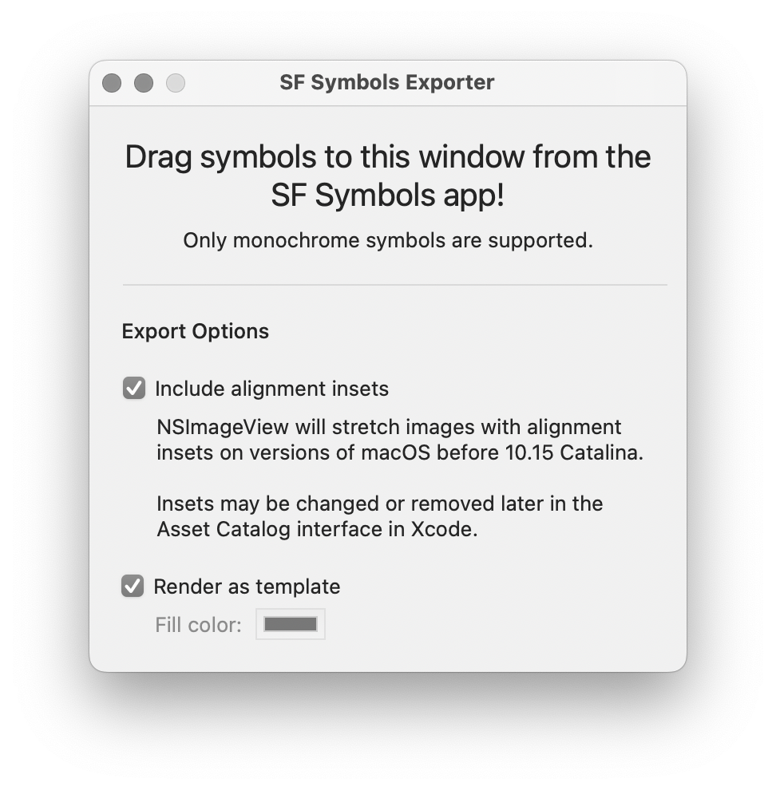

The creatively named *SF Symbols Exporter* exports symbols from the [SF Symbols app](https://developer.apple.com/sf-symbols/) to PDF imagesets which can be imported into Xcode asset catalogs. This allows you to use SF Symbols on versions of macOS well before it is officially supported.

Note that this uses several undocumented methods to obtain a symbol's vector path and alignment information. It may break at any moment. It is currently working with the SF Symbols app version 3.2 on Monterey.

Also note that the program currently only supports exporting monochrome versions of symbols.

